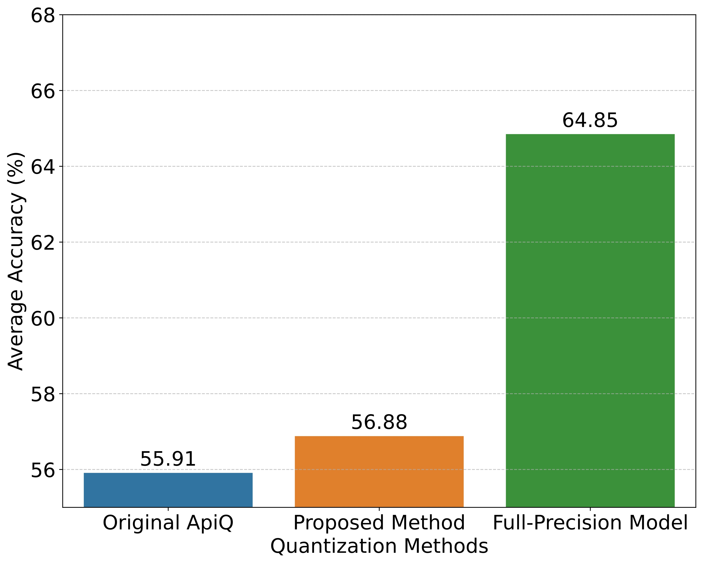
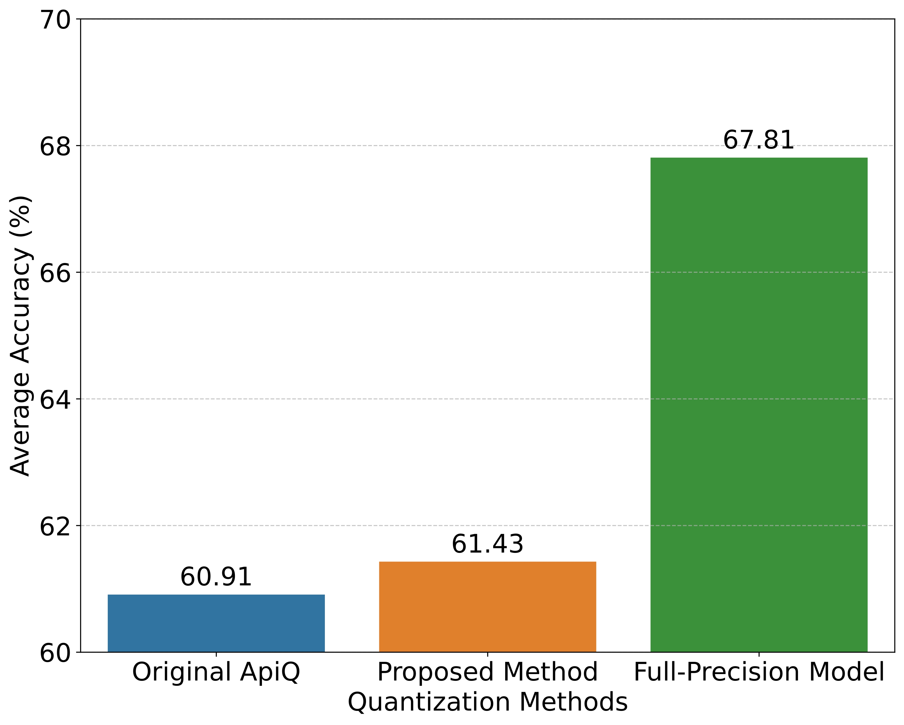

<h1 align="center">
    <p>ULB-SAPR</p>
</h1>
<h3 align="center">
    <p>Ultra-Low-Bit Quantization through Saliency Aware Partial Retraining</p>
</h3>
<h5 align="center">

[](https://arxiv.org/abs/2504.13932)
<br>

</h5>

ULB-SAPR (Ultra-Low-Bit Quantization through Saliency Aware Partial Retraining) is an advanced research framework for ultra-low-bit quantization and fine-tuning of Large Language Models. This method builds upon the PEFT-aware quantization method proposed by [ApiQ](https://arxiv.org/abs/2402.05147). This enhanced version includes:

- **Multi-Method Quantization**: Support for multiple quantization approaches including BinaryMoS and DB-LLM
- **Saliency-Aware Weight Preservation**: Advanced regularization techniques with gradient-based weighting
- **Flexible Training Stages**: Weight preservation training (WPT), output preservation training (OPT), and mixed training modes
- **Post-Training Quantization**: Superior performance across 2, 3, and 4-bit quantization levels
- **Memory-Efficient Fine-tuning**: Quantized model fine-tuning with significant GPU memory savings

<p align="center">
  
  
</p>

<p align="center"><b>Fig.&nbsp;3:</b>
Performance of our proposed method evaluated on LLaMA-2-7B model (left) and LLaMA-2-13B model (right) in terms of the average accuracy across 5 tasks (HellaSwag, Arc-Challenge, Arc-Easy, and PiQA).Performance of the
full-precision model is also added for reference.</p>

## Supports

### Quantization Methods

- **Default**: Traditional learnable weight clipping (LWC) quantization
- **[BinaryMoS](https://arxiv.org/abs/2406.12311)**: Binary Mixture-of-Scales with expert routing and learnable channel scales
- **[DB-LLM](https://arxiv.org/abs/2402.11960)**: Flexible Dual Binarization with learnable alpha parameters

### Model Support

- [x] **Llama-2** (7B, 13B, 70B variants)
- [x] **Mistral-7B-v0.1** with architecture-specific handling

### Training Modes

- [x] **Weight Preservation Training (WPT)**: Focus on preserving original weight relationships
- [x] **Output Preservation Training (OPT)**: Traditional output-based training
- [x] **Mixed Training**: Combined weight and output preservation with configurable coefficients

### Fine-tuning Tasks

- [x] **WikiText-2**: Causal language modeling
- [x] **GSM8K**: Mathematical reasoning
- [x] **Multi-task Training**: 4 arithmetic reasoning tasks (GSM8K, SVAMP, MAWPS, AQuA)
- [x] **Commonsense Reasoning**: Eight tasks (BoolQ, PIQA, SIQA, HellaSwag, WinoGrande, ARC-easy, ARC-challenge, OBQA)

## Release notes

- [2024.06.19] Release of code

## Contents

- [Install](#install)
- [Model Zoo](#model-zoo)
- [Quantization](#quantization)
  - [Basic Quantization](#basic-quantization)
  - [Advanced Quantization Methods](#advanced-quantization-methods)
  - [Training Stage Configuration](#training-stage-configuration)
- [Fine-tuning](#fine-tuning)
- [Citation](#citation)

## Install

```
conda create -n apiq python=3.10 -y
conda activate apiq
git clone https://github.com/BaohaoLiao/ApiQ.git
cd ApiQ
pip install --upgrade pip
pip install -e .
```

If you want to finetune a real quantized LLM, we leverage the kernel from [AutoGPTQ](https://github.com/AutoGPTQ/AutoGPTQ#quick-installation). You can install AutoGPTQ and optimum as follows:

```
git clone https://github.com/PanQiWei/AutoGPTQ.git && cd AutoGPTQ
pip install gekko
pip install -vvv --no-build-isolation -e .
pip install optimum>=0.20.0
```

## Model Zoo

We provide fake/real and symmetrically/asymmetrically quantized models at Huggingface.

- `fake`: The LLM's weights are still in FP16
- `real`: The LLM's weights are in GPTQ format
- `symmetric`: The quantization is symmetric, friendly to [vllm](https://github.com/vllm-project/vllm)
- `asymmetric`: The quantization is asymmetric

**Note**:

- For the finetuning of real quantized LLM, you need to use the real and symmetric version, because there is a bug in AutoGPTQ for the asymmetric quantizaion (see [discussion](https://github.com/OpenGVLab/OmniQuant/issues/57)).
- Fortunately, the difference between the symmetric and asymmetric quantization is very tiny. All results in the paper are from the asymmetric quantization.

## Quantization

### Basic Quantization

1. **Default Quantization** with learnable weight clipping:

```bash
SIZE=7
BIT=2
GS=64

SAVE_DIR=./model_zoos/Llama-2-${SIZE}b-hf-w${BIT}g${GS}-fake-sym
mkdir -p $SAVE_DIR

python ./apiq/main.py \
    --model_name_or_path meta-llama/Llama-2-${SIZE}b-hf \
    --quant_method default \
    --lwc --wbits ${BIT} --group_size ${GS} \
    --opt_epochs 20 --seqlen 2048 --nsamples 128 \
    --opt_peft_lr 0.0005 --opt_peft_wd 0.1 --opt_lwc_lr 0.005 --opt_lwc_wd 0.1 \
    --symmetric \
    --eval_ppl \
    --aug_loss \
    --save_dir $SAVE_DIR
```

### Advanced Quantization Methods

2. **BinaryMoS Quantization** with mixture-of-scales:

```bash
python ./apiq/main.py \
    --model_name_or_path meta-llama/Llama-2-7b-hf \
    --quant_method BinaryMoS \
    --num_expert 8 \
    --zero_point_type output_channel \
    --train_original_weights \
    --opt_epochs 20 --seqlen 2048 --nsamples 128 \
    --opt_peft_lr 0.0005 --opt_peft_wd 0.1 \
    --symmetric \
    --save_dir ./model_zoos/Llama-2-7b-BinaryMoS
```

3. **DB-LLM Quantization** with flexible dual binarization:

```bash
python ./apiq/main.py \
    --model_name_or_path meta-llama/Llama-2-7b-hf \
    --quant_method DB-LLM \
    --wbits 2 --group_size 64 \
    --opt_epochs 20 --seqlen 2048 --nsamples 128 \
    --opt_peft_lr 0.0005 --opt_peft_wd 0.1 \
    --symmetric \
    --save_dir ./model_zoos/Llama-2-7b-DB-LLM
```

### Training Stage Configuration

4. **Weight Preservation Training** with regularization:

```bash
python ./apiq/main.py \
    --model_name_or_path meta-llama/Llama-2-7b-hf \
    --lwc --wbits 2 --group_size 64 \
    --lambda_reg 0.1 --reg_method before_lora \
    --wpt_epochs 10 --wpt_peft_lr 0.0005 --wpt_lwc_lr 0.005 \
    --opt_epochs 10 --opt_peft_lr 0.0005 --opt_lwc_lr 0.005 \
    --save_dir ./model_zoos/Llama-2-7b-wpt
```

5. **Mixed Training** with both weight and output preservation:

```bash
python ./apiq/main.py \
    --model_name_or_path meta-llama/Llama-2-7b-hf \
    --lwc --wbits 2 --group_size 64 \
    --lambda_reg 0.05 --reg_method after_lora \
    --mixedt_epochs 20 \
    --mixedt_peft_lr 0.0005 --mixedt_lwc_lr 0.005 \
    --use_cosine_lr_scheduler --warmup_ratio 0.03 \
    --save_dir ./model_zoos/Llama-2-7b-mixed
```

6. **Saliency-Aware Weight Preservation** with gradient weighting:

```bash
python ./apiq/main.py \
    --model_name_or_path meta-llama/Llama-2-7b-hf \
    --lwc --wbits 2 --group_size 64 \
    --lambda_reg 0.1 --reg_method before_lora \
    --weighted_reg --gradient_dir ./gradients \
    --wpt_epochs 15 --opt_epochs 5 \
    --save_dir ./model_zoos/Llama-2-7b-saliency
```

### Output Files

Quantization will output the following files in `--save_dir`:

- `peft.pth`: PEFT adapter parameters
- `lwc.pth`: Quantization parameters (for default method)
- Folder `apiq_init/`: Files for PEFT model initialization
- Other: Quantized model in FP16 format, tokenizer files, etc

### Model Evaluation

7. **Evaluate** a quantized LLM with saved parameters:

```bash
SIZE=7
BIT=2
GS=64
SAVE_DIR=./model_zoos/Llama-2-${SIZE}b-hf-w${BIT}g${GS}-fake-sym

python ./apiq/main.py \
    --model_name_or_path meta-llama/Llama-2-${SIZE}b-hf \
    --quant_method default \
    --lwc --wbits ${BIT} --group_size ${GS} \
    --opt_epochs 0 --seqlen 2048 --nsamples 128 \
    --symmetric \
    --eval_ppl \
    --eval_tasks "winogrande,arc_easy,arc_challenge,boolq,piqa,hellaswag,openbookqa,siqa" \
    --save_dir $SAVE_DIR \
    --resume $SAVE_DIR
```

### GPTQ Conversion

8. **Convert** fake quantized model to real GPTQ format (**symmetric quantization only**):

```bash
SIZE=7
BIT=2
GS=64
RESUME_DIR=./model_zoos/Llama-2-${SIZE}b-hf-w${BIT}g${GS}-fake-sym
SAVE_DIR=./model_zoos/Llama-2-${SIZE}b-hf-w${BIT}g${GS}-real-sym
mkdir -p $SAVE_DIR

python ./apiq/main.py \
    --model_name_or_path meta-llama/Llama-2-${SIZE}b-hf \
    --quant_method default \
    --lwc --wbits ${BIT} --group_size ${GS} \
    --opt_epochs 0 --seqlen 2048 --nsamples 128 \
    --symmetric \
    --eval_ppl \
    --save_dir $SAVE_DIR \
    --resume $RESUME_DIR \
    --convert_to_gptq --real_quant
```

## Finetuning

1. WikiText-2

```
bash ./scripts/train_clm.sh
```

2. GSM8K

```
bash ./scripts/train_test_gsm8k.sh
```

3. Arithmetic / commonsense reasoning

```
# Download the training and test sets
bash ./scripts/download_datasets.sh

# Finetune
bash ./scripts/train_multitask.sh
```

## Aknowledgement

- Our code is based on [ApiQ](https://github.com/BaohaoLiao/ApiQ).

## Citation

If you find our work or our code useful, please cite our paper:

```
@article{cao2025enhancing,
  title={Enhancing Ultra-Low-Bit Quantization of Large Language Models Through Saliency-Aware Partial Retraining},
  author={Cao, Deyu and Aref, Samin},
  journal={arXiv preprint arXiv:2504.13932},
  year={2025}
}
```
